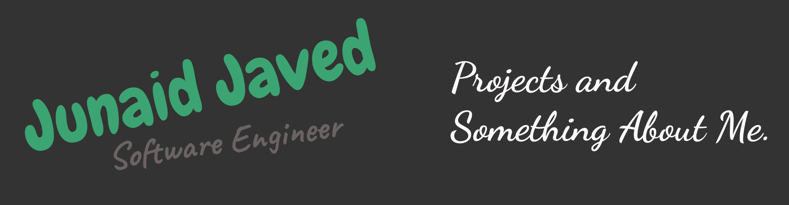

<h2>
Hello, folks &nbsp;
</h2>

My name is Junaid Javed and I'm a software developer / engineer. I'm from Pakistan, living in Haripur and currently studying Computer Science at college.

### 🛠️ Technologies & Tools

